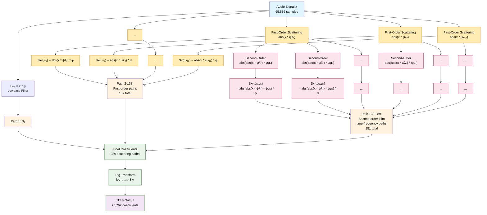

# JTFS Transform Computational Structure

This diagram illustrates the Joint Time-Frequency Scattering Transform (JTFS) used in the Perceptual-Neural-Physical (PNP) pipeline for audio analysis.

## Mermaid Diagram

## Key Parameters

**JTFS Configuration (from `src/pnp_synth/utils.py`)**:
- **J=13**: 13 temporal scales (j=0 to j=13)
- **Q=(12,1)**: 12 filters per octave for first-order, 1 for second-order
- **Q_fr=1**: 1 filter per octave in frequency dimension
- **F=2**: Local frequency averaging factor
- **Shape=(2¹⁶,)**: 65,536 sample input (FTM drum synthesis)

## Computational Structure

### Three Main Components

1. **Lowpass Path (1 path)**:
   - Direct filtering: `S₀x = x * φ`
   - Captures overall signal energy

2. **First-Order Scattering (137 paths)**:
   - Computation: `Sx(t,λ) = |x * ψλ| * φ`
   - Captures temporal modulations at different scales
   - 12 filters per octave × ~12 octaves ≈ 137 paths

3. **Second-Order Scattering (151 paths)**:
   - Computation: `Sx(t,λ,μ) = ||x * ψλ| * ψμ| * φ`
   - Captures joint time-frequency modulations
   - Cross-interactions between different temporal scales

### Path Distribution Across Scales

From computational analysis (289 total paths):
- **j=0**: 14 paths (finest temporal scale)
- **j=1-7**: 21-25 paths each
- **j=8,9**: 27 paths each (peak)
- **j=10-11**: 19-24 paths
- **j=12**: 2 paths
- **j=13**: 9 paths (coarsest temporal scale)

### Final Processing

- **Log compression**: `log₁₊₍₁₀₀₀·Sx₎` for numerical stability
- **Global averaging**: Temporal averaging for translation invariance
- **Output**: 20,762 perceptual coefficients

## Computational Complexity

This multi-scale structure explains the **500× computational overhead** for Jacobian computation:

- **Forward pass**: ~10ms (direct wavelet transforms)
- **Jacobian pass**: ~5000ms (automatic differentiation through all 289 paths)
- **Memory usage**: 100MB+ during differentiation vs 300KB forward

The dense dependency graph where every output coefficient depends on all input parameters creates exponential computational complexity for gradient computation.

## Perceptual Coverage

- **Frequency range**: 2.7 Hz to 11,025 Hz (12 octaves)
- **Temporal scales**: 1ms to 1000ms modulations
- **Musical relevance**: Spans sub-bass to high harmonics
- **Perceptual modeling**: Captures complex timbre characteristics for audio synthesis parameter estimation

## [Compute Time Analysis]( ./taslp23/README_COMPUTE_TIME.md)
